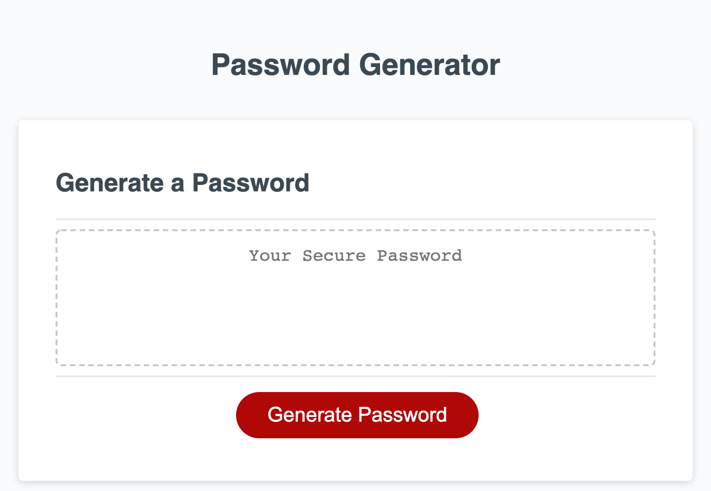

# Unit 03 HW: password-generator

## Description
This project allows an user to generate a random password based on their choice of criteria, such as the number of characters, special characters, numeric characters, lowercase characters, and uppercase characters. When user click a 'generate password' button, they are prompted with questions about slecting their criteria for thier password. Based on their criteria, it will generate random password and display on the window. The number of the password must be at least 8 characters but must not exceed 128 characters.

## Tasks Assigned
```
As an employee with access to sensitive data, he or she would like to randomly generate a password that meets certain criteria. This pass generator should be able to provide strong password under the criteria and perform high security.
```
- 

## Tasks Completed

```
As a web developer,
The following tasks were completed to meet the client's criteria:
```
- [x] When button is clicked, an employee is presented with a series of prompts for password criteria
- [x] An employee is able to select their preferred criteria
- [x] An employee is prompted with the length of the password and he or she must provide any number in between 8 and 128, inclusive. Otherwise, they will get an alert message
- [x] An employee is prompted to select the character criteria(types) and it is systemed so that at least one criteria is needed to proceed to generate the password
- [x] When an user select all criteria, the inputs are stored and execute the code to generate random password that meets all criteria
- [x] When the password is generated, it successfuly displays in the browser window.

## Screenshot of the Website



## Links

Deployed Website Link: [https://rhwlffk1028.github.io/code-refactoring-for-client/](https://rhwlffk1028.github.io/code-refactoring-for-client/)

Code Repository Link: [https://github.com/rhwlffk1028/code-refactoring-for-client/](https://github.com/rhwlffk1028/code-refactoring-for-client/)

> **Note**: Use the first link above to access the website. By clicking the deployed webiste link, you will be directed to the web browser and it will be viewable.<br>
> **Note**: Use the second link above to access the repository where the html, css, and image files are live.

## Copyright
---
Copyright (c) [2021] [Jun Choi] <br>
Confidential and Proprietary. All Rights Reserved.